# Strona internetowa Katedry Hodowli Zwierząt i Oceny Surowców

## Opis aplikacji:

Aplikacja powstała w celu zastąpienia starej (od 10 lat nieaktualizowanej) strony katedry. Ma ona odpowiadać na podstawowe potrzeby jej studentów oraz stanowić informację dla osób z zagranicy zainteresowanych wymianami ERASMUS z uczelnią.

## Opis podziału pracy:

Całą pracę wykonałem samodzielnie :)

## Baza danych:

Baza danych jest relacyjną bazą postawioną na postgresie zarządzaną przez ORM prisma. Ma ona 2 konfiguracje, aby uprościć konsultację postępów z przedstawicielem nietechnicznym katedry:

1. z neon postgres i vercelem dla prostej prezentacji na odległość,
2. lokalny z kontenerem do serwera CI na githubie, jak i na rzecz tego zadania.

Baza jest przygotowana na wielojęzyczność z prostą możliwością dodawania i usuwania języków z bazy. Posiada ona 2 tabele z opcją FTS:

1. aktualności z osobną kolumną ts_vector wyliczaną podczas dodawania artykułu, aby przyspieszyć późniejsze zapytania,
2. publikacje, której odpowiedni ts_vector jest obliczany przy każdym wyszukiwaniu, gdyż są to małe ilości tekstu (może ulec zmianie w przyszłości w zależności od narzutu na działanie aplikacji).

## Diagram ERD:

```mermaid
erDiagram
    News ||--o{ NewsTranslation : has_translations
    News ||--o{ Photo : has_photos
    News }|--|{ Tag : tagged_with
    Tag ||--o{ TagTranslation : has_translations

    News {
        String id PK
        Boolean published
        DateTime createdAt
        DateTime updatedAt
    }
    NewsTranslation {
        String newsId FK
        String languageCode
        String title
        String content
        String searchVector
    }
    Photo {
        String id PK
        String newsId FK
        String url
    }
    Tag {
        String id PK
        String name
    }
    TagTranslation {
        String tagId FK
        String languageCode
        String name
    }

    Team ||--o{ TeamTranslation : has_translations
    Team ||--o{ TeamMember : contains
    Team ||--o{ Publication : publishes
    Team ||--o{ ResearchProject : conducts
    Team ||--o{ TeachingCourse : teaches
    Team ||--o{ TeamLink : has_links

    Team {
        String id PK
        String slug
        String type
        Int displayOrder
    }
    TeamTranslation {
        String teamId FK
        String languageCode
        String name
        String researchDescription
        String teachingDescription
    }

    Publication ||--o{ PublicationTranslation : has_translations
    Publication {
        String id PK
        String teamId FK
        Int year
        String authors
        String journal
        String doi
    }
    PublicationTranslation {
        String publicationId FK
        String languageCode
        String title
    }

    ResearchProject ||--o{ ResearchProjectTranslation : has_translations
    ResearchProject {
        String id PK
        String teamId FK
        String years
    }
    ResearchProjectTranslation {
        String projectId FK
        String languageCode
        String title
        String funder
    }

    TeachingCourse ||--o{ TeachingCourseTranslation : has_translations
    TeachingCourse {
        String id PK
        String teamId FK
    }
    TeachingCourseTranslation {
        String courseId FK
        String languageCode
        String name
        String program
        String coordinator
    }

    Employee ||--o{ EmployeeTranslation : has_translations
    Employee ||--o{ TeamMember : is_member_of
    Employee ||--o{ Consultation : holds_consultations
    Employee ||--o| DepartmentHead : serves_as

    Employee {
        String id PK
        String firstName
        String lastName
        String email
        String phone
        String profileSlug
        String officeLocation
    }
    EmployeeTranslation {
        String employeeId FK
        String languageCode
        String academicTitle
    }
    Consultation ||--o{ ConsultationTranslation : has_translations
    Consultation {
        String id PK
        String employeeId FK
        String room
    }
    ConsultationTranslation {
        String consultationId FK
        String languageCode
        String day
        String time
    }

    TeamMember {
        String id PK
        String teamId FK
        String employeeId FK
        String category
    }

    DepartmentHead ||--o{ DepartmentHeadHour : has_hours
    DepartmentHead {
        String id PK
        String employeeId FK
    }
    DepartmentHeadHour ||--o{ DepartmentHeadHourTranslation : has_translations
    DepartmentHeadHour {
        String id PK
        String headId FK
    }
    DepartmentHeadHourTranslation {
        String hourId FK
        String languageCode
        String day
        String hours
    }

    Secretariat ||--o{ SecretariatTranslation : has_translations
    Secretariat ||--o{ SecretariatHour : has_hours
    Secretariat {
        String id PK
        String email
        String phone
        String officeLocation
    }
    SecretariatTranslation {
        String secretariatId FK
        String languageCode
        String title
    }
    SecretariatHour ||--o{ SecretariatHourTranslation : has_translations
    SecretariatHour {
        String id PK
        String secretariatId FK
    }
    SecretariatHourTranslation {
        String hourId FK
        String languageCode
        String day
        String hours
    }
```

